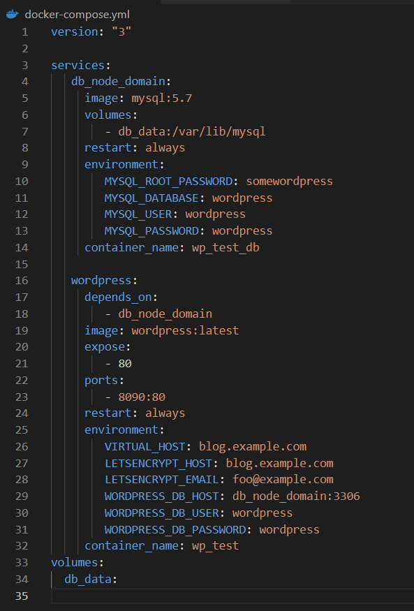
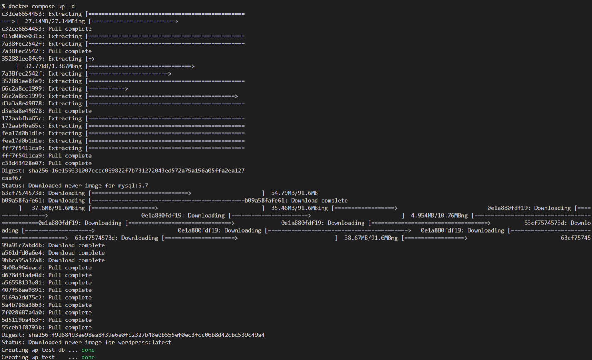
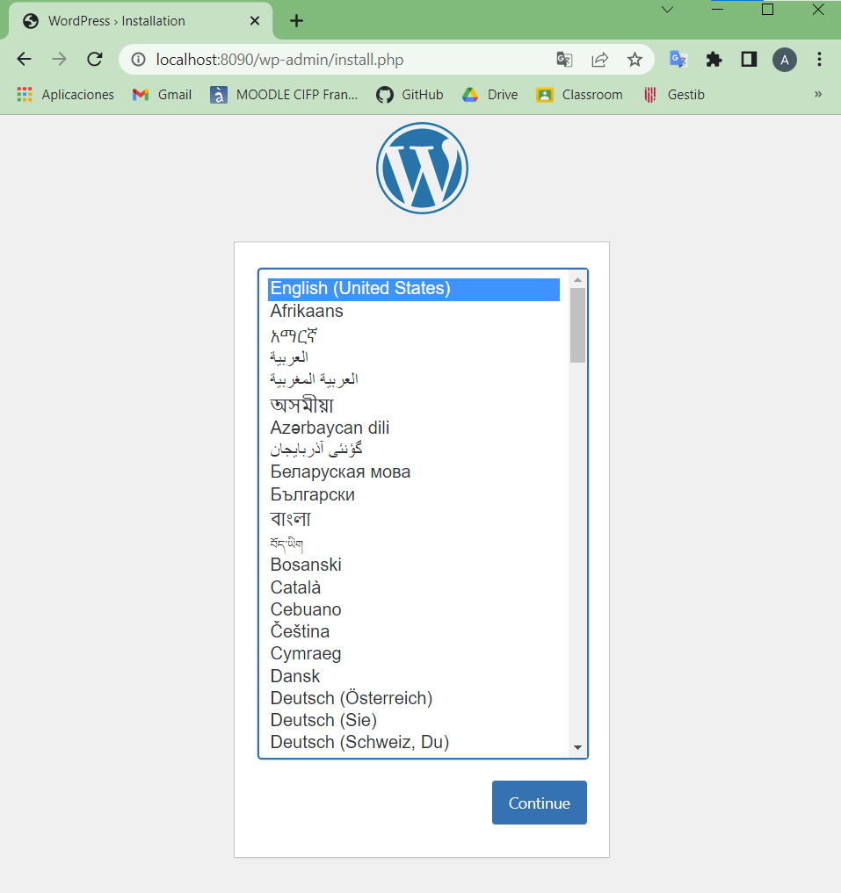

# docker-compose_wordpress-mysql

Para realizar esta tarea, lo primero que he hecho es crear el archivo ```docker-compose.yml``` con el siguiente contenido:


Gracias al docker compose podremos manejar varios contenedores a partir de un solo archivo de cofiguración.

Así que, para utilizar las imagenes de Wordpress y Mysql, solo hay que lanzar el siguiente comando:
``` docker-compose up -d ```



Finalmente, podemos ver que ha ido bien, si entramos en localhost:8090, como hemos especificado en el .yml, y obtenemos el siguiente resultado:
 
